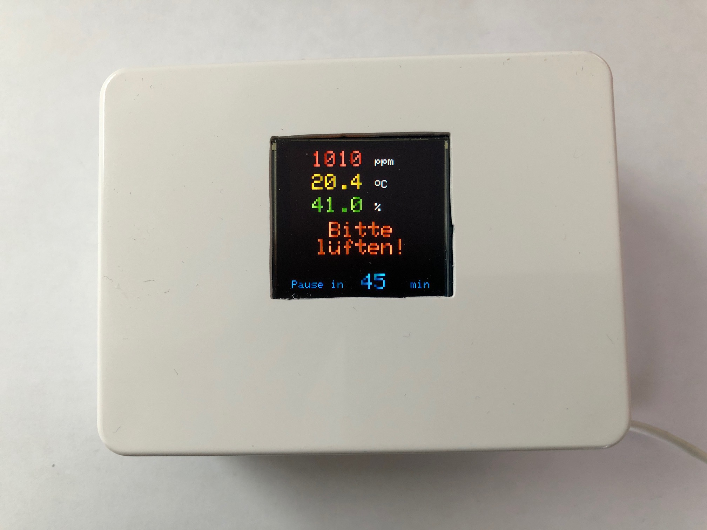
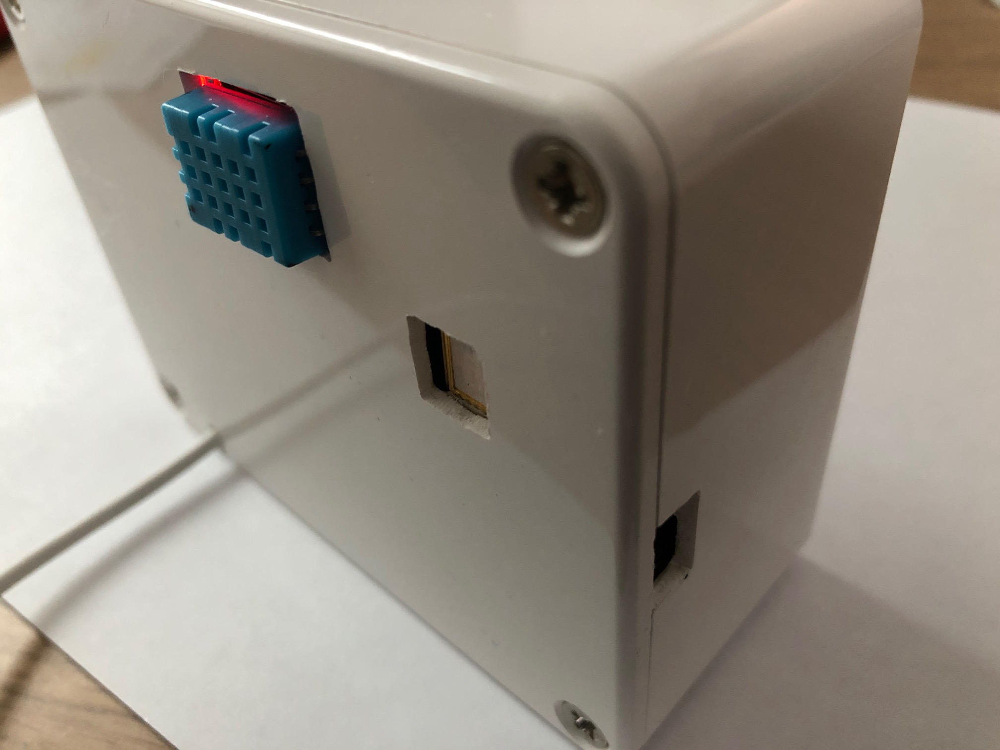

# Office-Climate-Control  
A work in progress device to get familiar with ESP82xx, misc sensors, Github, etc.  

CO2-, Temp-, Hum-Sensor with Display and visual warnings  
Based on Wemos D1 mini, MH-Z19B CO2-Sensor, OLED RGB 1.5" Display 128x128,
DHT11, Touch-Sensor  

  

  

The goal is to display the sensor values in green, yellow, red, cyan based on their values.
Also include a timer to remind me having a break from my work from time to time.  

**To Do List**
 * replace DHT11 with BME280  
 * Develop a break timer which reminds me to have a break after x minutes.  
  This timer will be controlled by the touch sensor inside the cover.  
 * Include u8g2 lib for better font handling


**To protect the display from burn in effects I have extended the Adafruit libs to include a dim function.**  

 * Adafruit_SSD1351.h  
    ```
    void dim(uint8 contrastlevel = 15);  // Display contrast 0-15
   ```


 * Adafruit_SSD1306.cpp  
    // Dim the display via CONTRASTMASTER 0-15
    void Adafruit_SSD1351::dim(uint8_t contrastlevel) {
      sendCommand(SSD1351_CMD_CONTRASTMASTER, &contrastlevel, 1);
    }

