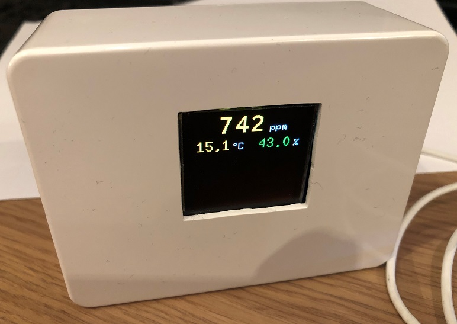

# Office-Climate-Control
[![LICENSE.txt][shield-license]][info-license]

Copyright (c) 2020-2021, Christian Heinrichs.
All rights reserved.


A work in progress device to get familiar with ESP82xx, misc sensors, Github, etc.  

Monitor the climate in your office and get warned when it's unhealthy or you should take a break.
Set a timer in 15min steps (15, 30, ..., 120min) to remind you to take a break.

CO2-, Temp-, Hum-Sensor with Display and visual warnings and Break Timer.
Based on Wemos D1 mini, MH-Z19B CO2-Sensor, OLED RGB 1.5" SPI Display 128x128, BME280, Touch-Sensor

Version: 1.00   18.02.2021


 


 


The goal is to display the sensor values in green, yellow, red, cyan based on their values.
Also include a timer to remind me having a break from my work from time to time.  


**To Do List**
 * Think about how to use the additional sensor values Pressure and Altitude from BME280.


**To protect the display from burn in effects I have extended the Adafruit_SSD1351 lib to include a dim function.**  

 * Adafruit_SSD1351.h  
    ```
    void dim(uint8 contrastlevel = 15);  // Display contrast 0-15
   ```


 * Adafruit_SSD1306.cpp  
   ```
    // Dim the display via CONTRASTMASTER 0-15
    void Adafruit_SSD1351::dim(uint8_t contrastlevel) {
      sendCommand(SSD1351_CMD_CONTRASTMASTER, &contrastlevel, 1);
    }
   ```
